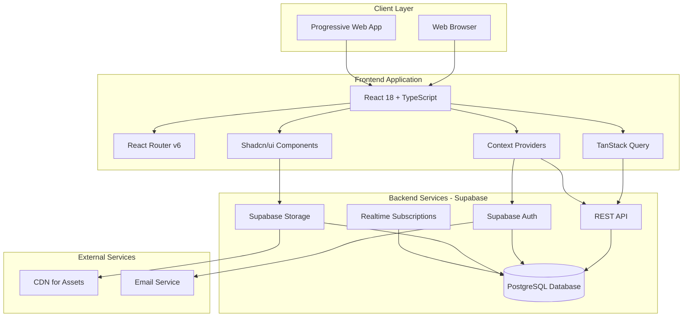
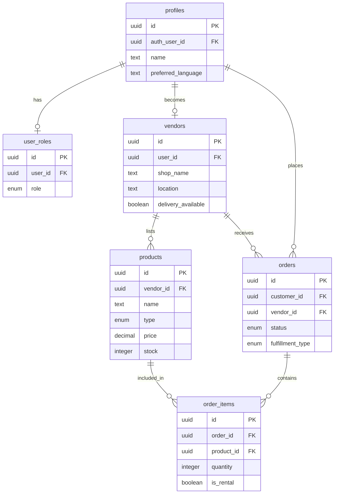
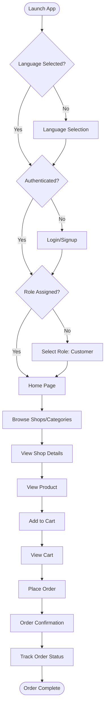
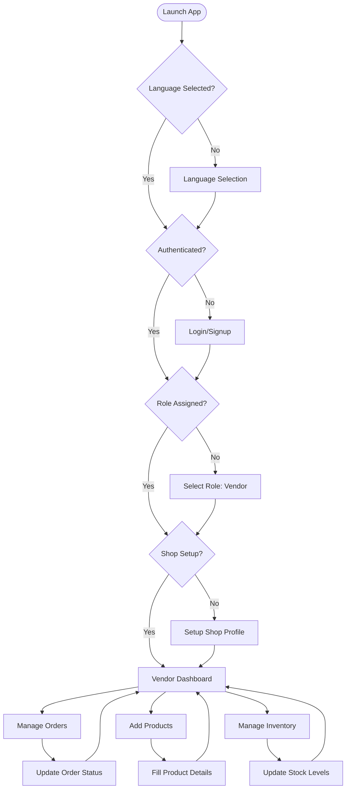
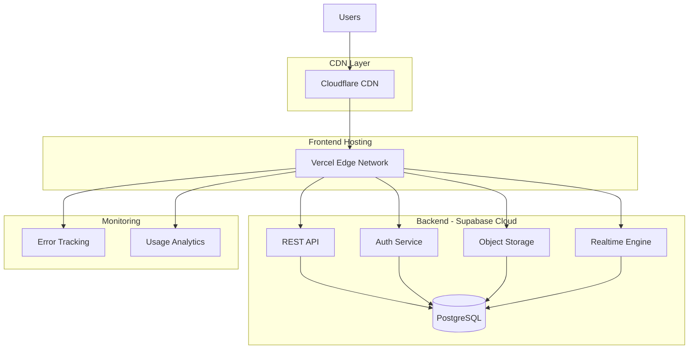

# Design Document: AI for Bharat Hackathon Submission

## Overview

Local Hardware is a multilingual marketplace platform built with React, TypeScript, and Supabase that connects customers with neighborhood hardware shops across India. The application implements a mobile-first, low-bandwidth optimized architecture with comprehensive multilingual support (English, Telugu, Hindi) to ensure digital inclusion for rural and semi-urban populations.

### Design Goals

1. **Digital Inclusion**: Enable users from diverse linguistic backgrounds to access digital commerce
2. **Local Business Empowerment**: Provide simple, zero-commission platform for neighborhood shops
3. **Rural Accessibility**: Optimize for low-bandwidth scenarios and mobile-first usage
4. **Scalability**: Architecture ready for multi-city expansion and AI integration
5. **User Experience**: Intuitive interfaces requiring minimal technical literacy

### Key Design Decisions

- **Supabase Backend**: Leverages PostgreSQL with built-in auth, storage, and real-time capabilities
- **React + TypeScript**: Type-safe frontend with component reusability
- **Context API + TanStack Query**: Efficient state management with server state caching
- **Shadcn/ui + Tailwind**: Consistent, accessible UI components with rapid development
- **Mobile-First Design**: Bottom navigation and touch-optimized interfaces
- **Translation System**: Custom i18n implementation with native script support

## Architecture

### High-Level Architecture




### System Components

#### Frontend Layer
- **React Application**: Single-page application with client-side routing
- **Context Providers**: Global state management for auth, language, and cart
- **TanStack Query**: Server state management with caching and optimistic updates
- **UI Components**: Reusable Shadcn/ui components with Tailwind styling

#### Backend Layer (Supabase)
- **PostgreSQL Database**: Relational database with Row Level Security
- **Authentication**: Email/password auth with session management
- **Storage**: Product image hosting with CDN delivery
- **REST API**: Auto-generated from database schema
- **Realtime**: WebSocket subscriptions for order updates

#### Infrastructure
- **Hosting**: Vercel/AWS Amplify for frontend deployment
- **Database**: Supabase Cloud with regional data centers
- **CDN**: Cloudflare/AWS CloudFront for asset delivery
- **Monitoring**: Supabase Dashboard + custom error tracking


## Components and Interfaces

### Frontend Component Hierarchy

```
App
├── LanguageProvider
│   └── AuthProvider
│       └── CartProvider
│           └── Router
│               ├── LanguageSelection (unauthenticated)
│               ├── Auth (unauthenticated)
│               ├── RoleSelection (authenticated, no role)
│               ├── VendorSetup (vendor, no shop)
│               ├── Customer Routes
│               │   ├── Index (home page)
│               │   ├── ShopList
│               │   ├── ShopDetail
│               │   ├── ProductDetail
│               │   ├── Cart
│               │   ├── Rentals
│               │   ├── CustomerOrders
│               │   └── Settings
│               └── Vendor Routes
│                   ├── VendorDashboard
│                   ├── VendorAddProduct
│                   ├── VendorInventory
│                   └── Settings
```

### Context Providers

#### LanguageContext


**Purpose**: Manages user language preference and provides translation function

**State**:
- `language`: Current selected language (en | te | hi)
- `isLanguageSelected`: Whether user has completed language selection
- `translations`: Translation dictionary for all supported languages

**Methods**:
- `setLanguage(lang)`: Updates language preference and persists to localStorage
- `t(key, params?)`: Translates key to current language with optional parameter substitution
- `markLanguageSelected()`: Marks language selection as complete

**Implementation**:
```typescript
interface LanguageContextType {
  language: Language;
  setLanguage: (lang: Language) => void;
  t: (key: string, params?: Record<string, string | number>) => string;
  isLanguageSelected: boolean;
  markLanguageSelected: () => void;
}
```

#### AuthContext

**Purpose**: Manages user authentication, session, and role

**State**:
- `user`: Current authenticated user object
- `session`: Active Supabase session
- `role`: User's selected role (customer | vendor | null)
- `loading`: Authentication state loading indicator
- `hasVendorShop`: Whether vendor has completed shop setup

**Methods**:
- `signUp(email, password, name)`: Creates new user account
- `signIn(email, password)`: Authenticates existing user
- `signOut()`: Ends user session
- `selectRole(role)`: Assigns role to authenticated user
- `fetchRole(userId)`: Retrieves user role from database

**Implementation**:
```typescript
interface AuthContextType {
  user: User | null;
  session: Session | null;
  role: AppRole;
  loading: boolean;
  signUp: (email: string, password: string, name: string) => Promise<{ error: string | null }>;
  signIn: (email: string, password: string) => Promise<{ error: string | null }>;
  signOut: () => Promise<void>;
  selectRole: (role: "customer" | "vendor") => Promise<{ error: string | null }>;
  hasVendorShop: boolean;
}
```

#### CartContext

**Purpose**: Manages shopping cart state for customer purchases

**State**:
- `items`: Array of cart items with product, vendor, quantity, rental info
- `totalItems`: Sum of all item quantities
- `totalPrice`: Calculated total including rental prices

**Methods**:
- `addItem(product, vendor, isRental?, rentalDuration?)`: Adds product to cart
- `removeItem(productId)`: Removes product from cart
- `updateQuantity(productId, quantity)`: Updates item quantity
- `clearCart()`: Empties entire cart

**Implementation**:
```typescript
interface CartContextType {
  items: CartItem[];
  addItem: (product: DBProduct, vendor: DBVendor, isRental?: boolean, rentalDuration?: "daily" | "weekly") => void;
  removeItem: (productId: string) => void;
  updateQuantity: (productId: string, quantity: number) => void;
  clearCart: () => void;
  totalItems: number;
  totalPrice: number;
}
```


### Key Page Components

#### LanguageSelection
- Displays language options with native script names
- Persists selection to localStorage
- Redirects to Auth page after selection

#### Auth
- Dual-mode form for login and signup
- Email/password authentication via Supabase
- Displays success/error messages in selected language
- Redirects to RoleSelection after successful auth

#### RoleSelection
- Presents Customer and Vendor role options
- Creates user_roles record in database
- Redirects based on selected role

#### Index (Customer Home)
- Category-based shop browsing
- Search functionality across products
- Featured rental tools section
- Nearby shops display with delivery info

#### ShopDetail
- Shop information and operating status
- Product catalog with filtering
- Add to cart functionality
- Delivery/pickup options display

#### ProductDetail
- Product images and description
- Pricing for buy/rent options
- Stock availability status
- Rental duration selection for rental products
- Add to cart with quantity selection

#### Cart
- Items grouped by shop
- Subtotal calculation per shop
- Delivery charge display
- Order placement with customer details
- Payment method selection (COD/UPI)

#### VendorDashboard
- Order statistics (today's orders, revenue, pending)
- Order list with status management
- Quick actions for order fulfillment
- Navigation to inventory and product management

#### VendorInventory
- Product list with stock levels
- Quick stock update functionality
- Product activation/deactivation
- Low stock warnings


## Data Models

### Database Schema

#### profiles
Stores user profile information and language preferences.

```sql
CREATE TABLE profiles (
  id UUID PRIMARY KEY DEFAULT uuid_generate_v4(),
  auth_user_id UUID REFERENCES auth.users NOT NULL UNIQUE,
  name TEXT NOT NULL DEFAULT '',
  email TEXT,
  phone TEXT,
  address TEXT,
  preferred_language TEXT NOT NULL DEFAULT 'en',
  created_at TIMESTAMPTZ NOT NULL DEFAULT NOW(),
  updated_at TIMESTAMPTZ NOT NULL DEFAULT NOW()
);
```

**Fields**:
- `id`: Primary key
- `auth_user_id`: Reference to Supabase auth user
- `name`: User's full name
- `email`: Contact email
- `phone`: Contact phone number
- `address`: Delivery address for customers
- `preferred_language`: UI language preference (en/te/hi)
- `created_at`, `updated_at`: Timestamps

#### user_roles
Manages role assignment for users (customer or vendor).

```sql
CREATE TABLE user_roles (
  id UUID PRIMARY KEY DEFAULT uuid_generate_v4(),
  user_id UUID NOT NULL,
  role app_role NOT NULL,
  created_at TIMESTAMPTZ NOT NULL DEFAULT NOW(),
  UNIQUE(user_id)
);

CREATE TYPE app_role AS ENUM ('customer', 'vendor');
```

**Fields**:
- `id`: Primary key
- `user_id`: Reference to user (from auth)
- `role`: Enum value (customer | vendor)
- `created_at`: Timestamp

**Constraints**:
- One role per user (UNIQUE constraint)

#### vendors
Stores shop information for vendor users.

```sql
CREATE TABLE vendors (
  id UUID PRIMARY KEY DEFAULT uuid_generate_v4(),
  user_id UUID NOT NULL UNIQUE,
  shop_name TEXT NOT NULL,
  shop_description TEXT,
  shop_image_url TEXT,
  location TEXT,
  latitude DECIMAL,
  longitude DECIMAL,
  phone TEXT,
  categories TEXT[],
  delivery_available BOOLEAN DEFAULT false,
  delivery_charge DECIMAL,
  estimated_delivery_time TEXT,
  is_open BOOLEAN DEFAULT true,
  rating DECIMAL,
  created_at TIMESTAMPTZ NOT NULL DEFAULT NOW(),
  updated_at TIMESTAMPTZ NOT NULL DEFAULT NOW()
);
```

**Fields**:
- `id`: Primary key
- `user_id`: Reference to vendor user
- `shop_name`: Business name
- `shop_description`: About the shop
- `shop_image_url`: Shop logo/photo
- `location`: Address text
- `latitude`, `longitude`: Geolocation coordinates
- `phone`: Contact number
- `categories`: Array of product categories sold
- `delivery_available`: Whether shop offers delivery
- `delivery_charge`: Delivery fee amount
- `estimated_delivery_time`: Delivery time estimate
- `is_open`: Current operating status
- `rating`: Shop rating (future feature)
- `created_at`, `updated_at`: Timestamps


#### products
Product catalog with support for sell, rent, or both.

```sql
CREATE TABLE products (
  id UUID PRIMARY KEY DEFAULT uuid_generate_v4(),
  vendor_id UUID REFERENCES vendors(id) NOT NULL,
  name TEXT NOT NULL,
  description TEXT,
  category TEXT NOT NULL,
  type product_type NOT NULL DEFAULT 'sell',
  price DECIMAL,
  rental_price_hourly DECIMAL,
  rental_price_daily DECIMAL,
  rental_price_weekly DECIMAL,
  deposit DECIMAL,
  unit TEXT,
  stock INTEGER NOT NULL DEFAULT 0,
  in_stock BOOLEAN NOT NULL DEFAULT true,
  is_active BOOLEAN NOT NULL DEFAULT true,
  image_url TEXT,
  specs JSONB,
  created_at TIMESTAMPTZ NOT NULL DEFAULT NOW(),
  updated_at TIMESTAMPTZ NOT NULL DEFAULT NOW()
);

CREATE TYPE product_type AS ENUM ('sell', 'rent', 'both');
```

**Fields**:
- `id`: Primary key
- `vendor_id`: Reference to vendor shop
- `name`: Product name
- `description`: Product details
- `category`: Product category
- `type`: Enum (sell | rent | both)
- `price`: Sale price (for sell/both types)
- `rental_price_hourly`, `rental_price_daily`, `rental_price_weekly`: Rental pricing tiers
- `deposit`: Refundable deposit for rentals
- `unit`: Measurement unit (kg, piece, etc.)
- `stock`: Available quantity
- `in_stock`: Availability flag
- `is_active`: Whether product is listed
- `image_url`: Product photo
- `specs`: JSON object for specifications
- `created_at`, `updated_at`: Timestamps

#### orders
Order records for purchases and rentals.

```sql
CREATE TABLE orders (
  id UUID PRIMARY KEY DEFAULT uuid_generate_v4(),
  customer_id UUID NOT NULL,
  vendor_id UUID REFERENCES vendors(id) NOT NULL,
  order_type order_type NOT NULL DEFAULT 'buy',
  fulfillment_type fulfillment_type NOT NULL DEFAULT 'delivery',
  status order_status NOT NULL DEFAULT 'pending',
  customer_name TEXT,
  customer_phone TEXT,
  delivery_address TEXT,
  total_amount DECIMAL NOT NULL DEFAULT 0,
  delivery_charge DECIMAL,
  deposit_amount DECIMAL,
  notes TEXT,
  created_at TIMESTAMPTZ NOT NULL DEFAULT NOW(),
  updated_at TIMESTAMPTZ NOT NULL DEFAULT NOW()
);

CREATE TYPE order_type AS ENUM ('buy', 'rent');
CREATE TYPE fulfillment_type AS ENUM ('delivery', 'pickup');
CREATE TYPE order_status AS ENUM (
  'pending', 'confirmed', 'preparing', 
  'out_for_delivery', 'ready_for_pickup', 
  'completed', 'cancelled'
);
```

**Fields**:
- `id`: Primary key
- `customer_id`: Reference to customer user
- `vendor_id`: Reference to vendor shop
- `order_type`: Enum (buy | rent)
- `fulfillment_type`: Enum (delivery | pickup)
- `status`: Order status enum
- `customer_name`, `customer_phone`: Contact details
- `delivery_address`: Delivery location
- `total_amount`: Order total
- `delivery_charge`: Delivery fee
- `deposit_amount`: Total deposits for rentals
- `notes`: Additional instructions
- `created_at`, `updated_at`: Timestamps


#### order_items
Line items for each order with rental duration support.

```sql
CREATE TABLE order_items (
  id UUID PRIMARY KEY DEFAULT uuid_generate_v4(),
  order_id UUID REFERENCES orders(id) NOT NULL,
  product_id UUID REFERENCES products(id) NOT NULL,
  quantity INTEGER NOT NULL DEFAULT 1,
  price_at_purchase DECIMAL NOT NULL,
  is_rental BOOLEAN DEFAULT false,
  rental_duration rental_duration_type,
  rental_start_date TIMESTAMPTZ,
  rental_end_date TIMESTAMPTZ,
  deposit_amount DECIMAL,
  created_at TIMESTAMPTZ NOT NULL DEFAULT NOW()
);

CREATE TYPE rental_duration_type AS ENUM ('hourly', 'daily', 'weekly');
```

**Fields**:
- `id`: Primary key
- `order_id`: Reference to parent order
- `product_id`: Reference to product
- `quantity`: Number of units
- `price_at_purchase`: Price snapshot at order time
- `is_rental`: Whether this is a rental item
- `rental_duration`: Duration type for rentals
- `rental_start_date`, `rental_end_date`: Rental period
- `deposit_amount`: Deposit for this item
- `created_at`: Timestamp

### Data Relationships




## API Endpoints

The application uses Supabase's auto-generated REST API based on the database schema. All endpoints follow the PostgREST specification.

### Authentication Endpoints

**POST /auth/v1/signup**
- Creates new user account
- Body: `{ email, password, options: { data: { name } } }`
- Returns: User object and session

**POST /auth/v1/token?grant_type=password**
- Authenticates existing user
- Body: `{ email, password }`
- Returns: Session with access token

**POST /auth/v1/logout**
- Ends current session
- Headers: `Authorization: Bearer {token}`
- Returns: Success status

### Database Endpoints (REST API)

**GET /rest/v1/profiles**
- Query: `?auth_user_id=eq.{userId}`
- Returns: User profile data

**POST /rest/v1/user_roles**
- Body: `{ user_id, role }`
- Returns: Created role record

**GET /rest/v1/vendors**
- Query: `?user_id=eq.{userId}`
- Returns: Vendor shop information

**POST /rest/v1/vendors**
- Body: Vendor shop data
- Returns: Created vendor record

**GET /rest/v1/products**
- Query: `?vendor_id=eq.{vendorId}&is_active=eq.true`
- Returns: Product list

**POST /rest/v1/products**
- Body: Product data
- Returns: Created product record

**PATCH /rest/v1/products?id=eq.{productId}**
- Body: Updated product fields
- Returns: Updated product record

**GET /rest/v1/orders**
- Query: `?vendor_id=eq.{vendorId}&order=created_at.desc`
- Returns: Order list for vendor

**POST /rest/v1/orders**
- Body: Order data
- Returns: Created order record

**PATCH /rest/v1/orders?id=eq.{orderId}**
- Body: `{ status }`
- Returns: Updated order record

**POST /rest/v1/order_items**
- Body: Array of order items
- Returns: Created order item records

### Storage Endpoints

**POST /storage/v1/object/product-images/{filename}**
- Uploads product image
- Body: File binary
- Returns: Public URL

**GET /storage/v1/object/public/product-images/{filename}**
- Retrieves product image
- Returns: Image file

### Realtime Subscriptions

**WebSocket /realtime/v1**
- Subscribe to table changes
- Channel: `public:orders:vendor_id=eq.{vendorId}`
- Events: INSERT, UPDATE, DELETE


## User Flows

### Customer Journey



### Vendor Journey




## Correctness Properties

A property is a characteristic or behavior that should hold true across all valid executions of a system—essentially, a formal statement about what the system should do. Properties serve as the bridge between human-readable specifications and machine-verifiable correctness guarantees.

### Language and Localization Properties

Property 1: Language Persistence
*For any* language selection (English, Telugu, or Hindi), persisting the selection should result in the same language being retrieved from localStorage on subsequent app launches
**Validates: Requirements 1.2**

Property 2: Translation Completeness
*For any* translation key and selected language, the translation function should return text in the selected language (or fallback to English if translation missing)
**Validates: Requirements 1.4**

Property 3: Native Script Rendering
*For any* Telugu text, the rendered output should contain Telugu Unicode characters (U+0C00 to U+0C7F), and for any Hindi text, the rendered output should contain Devanagari Unicode characters (U+0900 to U+097F)
**Validates: Requirements 1.5**

Property 4: Price Formatting
*For any* numeric price value, the formatted output should include the ₹ symbol and proper thousand separators
**Validates: Requirements 1.6**

### Authentication and Profile Properties

Property 5: Profile Data Round Trip
*For any* valid profile update (name, email, phone, address, language), saving then retrieving the profile should return equivalent data
**Validates: Requirements 2.3, 2.4**

Property 6: Session Persistence
*For any* authenticated session, closing and reopening the browser (without explicit logout) should maintain the authenticated state
**Validates: Requirements 2.6**

Property 7: Localized Error Messages
*For any* authentication error and selected language, the error message should be displayed in the user's selected language
**Validates: Requirements 2.5**

### Role-Based Access Control Properties

Property 8: Customer Route Access
*For any* user with customer role, all customer routes (home, shops, cart, orders, rentals, settings) should be accessible and vendor routes should be blocked
**Validates: Requirements 3.2, 3.4**

Property 9: Vendor Route Access
*For any* user with vendor role and completed shop setup, all vendor routes (dashboard, inventory, add-product, settings) should be accessible and customer routes should be blocked
**Validates: Requirements 3.3, 3.4**

### Shop and Product Management Properties

Property 10: Shop Data Completeness
*For any* shop creation, the created shop record should contain all required fields (shop_name, user_id, location, phone, categories, delivery_available)
**Validates: Requirements 4.1**

Property 11: Delivery Conditional Validation
*For any* shop with delivery_available = true, the shop record should have non-null delivery_charge and estimated_delivery_time
**Validates: Requirements 4.3**

Property 12: Product-Vendor Association
*For any* product created by a vendor, the product's vendor_id should match the vendor's shop id
**Validates: Requirements 4.6**

Property 13: Product Required Fields
*For any* product creation, the product record should contain name, category, type, and stock fields
**Validates: Requirements 5.1**

Property 14: Rental Product Validation
*For any* product with type "rent" or "both", the product should have at least one rental price field (hourly/daily/weekly) and a deposit amount
**Validates: Requirements 5.2**

Property 15: Stock Availability Consistency
*For any* product, when stock = 0, then in_stock should be false, and when stock > 0, then in_stock should be true
**Validates: Requirements 5.4, 5.6**

### Cart and Order Properties

Property 16: Cart Item Addition
*For any* product and vendor, adding the product to cart should result in the cart containing an item with that product's id and the vendor's id
**Validates: Requirements 7.1**

Property 17: Cart Subtotal Calculation
*For any* cart state, the sum of (price × quantity) for all items from the same vendor should equal the vendor's subtotal
**Validates: Requirements 7.3**

Property 18: Order Total Calculation
*For any* cart with items, the order total should equal the sum of all item prices plus all delivery charges plus all rental deposits
**Validates: Requirements 7.4**

Property 19: Order Creation Completeness
*For any* order placement, the created order record should have customer_id, vendor_id, status, fulfillment_type, and total_amount fields populated
**Validates: Requirements 7.7**

### Order Status Management Properties

Property 20: Order Status Transitions
*For any* order, valid status transitions should be: pending → confirmed → preparing → (out_for_delivery OR ready_for_pickup) → completed, and any status can transition to cancelled
**Validates: Requirements 8.2, 8.3, 8.4, 8.5, 8.6, 8.7**

Property 21: Order Visibility to Vendor
*For any* order with vendor_id matching a vendor's shop, that order should appear in the vendor's dashboard order list
**Validates: Requirements 8.1**

Property 22: Order Status Synchronization
*For any* order status update by vendor, the updated status should be immediately visible in the customer's order tracking view
**Validates: Requirements 8.8**

### Rental Properties

Property 23: Rental Product Filtering
*For any* rental product query, the results should only include products where type = "rent" OR type = "both"
**Validates: Requirements 9.1**

Property 24: Rental Cost Calculation
*For any* rental order item, the total cost should equal (rental_price_for_duration × quantity) + (deposit × quantity)
**Validates: Requirements 9.3**

Property 25: Rental Date Tracking
*For any* rental order item, both rental_start_date and rental_end_date should be non-null
**Validates: Requirements 9.4**

### Inventory Management Properties

Property 26: Inventory Update Immediacy
*For any* product stock update, querying the product immediately after should return the updated stock value
**Validates: Requirements 11.3**

Property 27: Low Stock Detection
*For any* product with stock below a threshold (e.g., 5 units), the inventory view should display a low stock warning
**Validates: Requirements 11.4**


## Error Handling

### Frontend Error Handling

#### Authentication Errors
- **Invalid Credentials**: Display localized error message "Invalid email or password"
- **Email Already Exists**: Display localized error message "Account already exists"
- **Network Errors**: Display "Connection error. Please check your internet" with retry option
- **Session Expired**: Redirect to login page with "Session expired" message

#### Form Validation Errors
- **Required Fields**: Highlight missing fields with red border and error text
- **Invalid Email**: Show "Please enter a valid email address"
- **Weak Password**: Show "Password must be at least 6 characters"
- **Invalid Phone**: Show "Please enter a valid phone number"

#### Cart and Order Errors
- **Out of Stock**: Prevent add to cart and show "Product out of stock"
- **Insufficient Stock**: Show "Only X units available"
- **Empty Cart**: Disable checkout button and show "Cart is empty"
- **Order Placement Failed**: Show error message and retain cart state

#### Product Management Errors
- **Missing Required Fields**: Highlight fields and prevent submission
- **Invalid Price**: Show "Price must be a positive number"
- **Image Upload Failed**: Show error and allow retry
- **Stock Update Failed**: Show error and revert to previous value

### Backend Error Handling (Supabase)

#### Database Errors
- **Constraint Violations**: Return 409 Conflict with descriptive message
- **Foreign Key Violations**: Return 400 Bad Request with relationship error
- **Unique Violations**: Return 409 Conflict for duplicate entries
- **Not Found**: Return 404 for missing resources

#### Authentication Errors
- **Invalid Token**: Return 401 Unauthorized
- **Expired Token**: Return 401 with token_expired code
- **Insufficient Permissions**: Return 403 Forbidden

#### Row Level Security (RLS) Errors
- **Unauthorized Read**: Return empty result set
- **Unauthorized Write**: Return 403 Forbidden
- **Policy Violation**: Return 403 with policy name

### Error Recovery Strategies

#### Optimistic Updates
- Update UI immediately for better UX
- Revert changes if server request fails
- Show toast notification on failure

#### Retry Logic
- Automatic retry for network errors (max 3 attempts)
- Exponential backoff for rate limiting
- Manual retry button for user-initiated actions

#### Graceful Degradation
- Show cached data when offline
- Disable features requiring network
- Queue actions for later sync

#### Error Logging
- Log errors to console in development
- Send error reports to monitoring service in production
- Include user context and stack traces


## Testing Strategy

### Dual Testing Approach

The application requires both unit testing and property-based testing for comprehensive coverage:

- **Unit Tests**: Verify specific examples, edge cases, and error conditions
- **Property Tests**: Verify universal properties across all inputs
- Together they provide comprehensive coverage: unit tests catch concrete bugs, property tests verify general correctness

### Unit Testing

#### Framework and Tools
- **Test Runner**: Vitest
- **Testing Library**: React Testing Library
- **Mocking**: Vitest mocks for Supabase client
- **Coverage Target**: > 80% code coverage

#### Unit Test Categories

**Component Tests**:
- Language selection renders all three language options
- Auth form switches between login and signup modes
- Cart displays items grouped by vendor
- Product detail shows correct pricing for buy vs rent
- Vendor dashboard displays order statistics

**Context Tests**:
- LanguageContext persists language to localStorage
- AuthContext maintains session state
- CartContext calculates totals correctly
- Role-based routing redirects appropriately

**Integration Tests**:
- Complete user signup flow
- Product addition to cart flow
- Order placement flow
- Vendor order fulfillment flow

**Edge Cases**:
- Empty cart checkout attempt
- Out of stock product addition
- Invalid form submissions
- Network error handling

### Property-Based Testing

#### Framework
- **Library**: fast-check (for TypeScript/JavaScript)
- **Configuration**: Minimum 100 iterations per property test
- **Tagging**: Each test references its design document property

#### Property Test Implementation

Each correctness property from the design document should be implemented as a property-based test:

**Example Property Test**:
```typescript
// Feature: ai-bharat-hackathon-submission, Property 1: Language Persistence
test('language persistence property', () => {
  fc.assert(
    fc.property(
      fc.constantFrom('en', 'te', 'hi'),
      (language) => {
        // Set language
        localStorage.setItem('app_language', language);
        
        // Retrieve language
        const retrieved = localStorage.getItem('app_language');
        
        // Should be equal
        return retrieved === language;
      }
    ),
    { numRuns: 100 }
  );
});
```

#### Property Test Categories

**Translation Properties**:
- Property 1: Language Persistence
- Property 2: Translation Completeness
- Property 3: Native Script Rendering
- Property 4: Price Formatting

**Data Integrity Properties**:
- Property 5: Profile Data Round Trip
- Property 10: Shop Data Completeness
- Property 12: Product-Vendor Association
- Property 13: Product Required Fields

**Calculation Properties**:
- Property 17: Cart Subtotal Calculation
- Property 18: Order Total Calculation
- Property 24: Rental Cost Calculation

**State Management Properties**:
- Property 15: Stock Availability Consistency
- Property 20: Order Status Transitions
- Property 26: Inventory Update Immediacy

**Access Control Properties**:
- Property 8: Customer Route Access
- Property 9: Vendor Route Access

### Test Data Generation

#### Generators for Property Tests
- **Language Generator**: `fc.constantFrom('en', 'te', 'hi')`
- **User Generator**: Random user objects with valid fields
- **Product Generator**: Random products with valid types and prices
- **Order Generator**: Random orders with valid status values
- **Cart Generator**: Random cart states with multiple items

#### Mock Data
- Sample shops with various configurations
- Sample products across all categories
- Sample orders in different statuses
- Sample users with different roles

### Testing Workflow

1. **Development**: Write unit tests alongside feature implementation
2. **Property Tests**: Implement property tests after core functionality is stable
3. **CI/CD**: Run all tests on every commit
4. **Coverage**: Monitor coverage and add tests for uncovered paths
5. **Regression**: Add tests for every bug fix

### Performance Testing

#### Load Testing
- Simulate 1000+ concurrent users
- Test database query performance
- Measure API response times
- Monitor memory usage

#### Network Testing
- Test on simulated 3G networks
- Measure page load times
- Test offline functionality
- Verify asset caching


## Deployment Architecture

### Production Environment



### Hosting Configuration

#### Frontend (Vercel)
- **Build Command**: `npm run build`
- **Output Directory**: `dist`
- **Node Version**: 18.x
- **Environment Variables**:
  - `VITE_SUPABASE_URL`
  - `VITE_SUPABASE_ANON_KEY`
- **Edge Network**: Global CDN with automatic SSL
- **Deployment**: Automatic on git push to main branch

#### Backend (Supabase Cloud)
- **Region**: Asia Pacific (Mumbai) for India users
- **Database**: PostgreSQL 15 with connection pooling
- **Storage**: S3-compatible object storage
- **Auth**: Built-in authentication service
- **Realtime**: WebSocket server for live updates

### Environment Configuration

#### Development
- Local Vite dev server on port 5173
- Supabase local development (optional)
- Hot module replacement enabled
- Source maps enabled

#### Staging
- Vercel preview deployments
- Separate Supabase project
- Test data and mock shops
- Feature flags for testing

#### Production
- Vercel production deployment
- Production Supabase project
- Real user data
- Performance monitoring enabled

### CI/CD Pipeline

```yaml
# .github/workflows/deploy.yml
name: Deploy
on:
  push:
    branches: [main]
  pull_request:
    branches: [main]

jobs:
  test:
    runs-on: ubuntu-latest
    steps:
      - uses: actions/checkout@v3
      - uses: actions/setup-node@v3
      - run: npm ci
      - run: npm run lint
      - run: npm run test
      - run: npm run build

  deploy:
    needs: test
    if: github.ref == 'refs/heads/main'
    runs-on: ubuntu-latest
    steps:
      - uses: actions/checkout@v3
      - uses: vercel/action@v1
        with:
          vercel-token: ${{ secrets.VERCEL_TOKEN }}
          vercel-org-id: ${{ secrets.VERCEL_ORG_ID }}
          vercel-project-id: ${{ secrets.VERCEL_PROJECT_ID }}
```

### Database Migration Strategy

#### Migration Files
- Stored in `supabase/migrations/`
- Timestamped SQL files
- Version controlled in git
- Applied automatically on deployment

#### Migration Process
1. Create migration file locally
2. Test migration on local database
3. Commit migration to git
4. Deploy to staging environment
5. Verify migration success
6. Deploy to production

### Backup and Recovery

#### Database Backups
- Automatic daily backups by Supabase
- Point-in-time recovery available
- 7-day retention for free tier
- 30-day retention for paid tier

#### Disaster Recovery
- Database replication across availability zones
- Automatic failover for high availability
- Recovery Time Objective (RTO): < 1 hour
- Recovery Point Objective (RPO): < 5 minutes


## Scalability Considerations

### Horizontal Scaling

#### Frontend Scaling
- **Static Assets**: Served via global CDN with edge caching
- **API Requests**: Load balanced across Supabase infrastructure
- **Concurrent Users**: Vercel Edge Network handles 1000+ concurrent connections
- **Geographic Distribution**: CDN nodes in multiple Indian cities

#### Database Scaling
- **Connection Pooling**: PgBouncer for efficient connection management
- **Read Replicas**: For read-heavy operations (future enhancement)
- **Indexing Strategy**: Indexes on frequently queried columns
- **Query Optimization**: Efficient queries with proper joins and filters

### Performance Optimization

#### Frontend Optimizations
- **Code Splitting**: Route-based lazy loading
- **Tree Shaking**: Remove unused code from bundles
- **Image Optimization**: WebP format with lazy loading
- **Bundle Size**: Target < 200KB initial bundle
- **Caching Strategy**: Service worker for offline support

#### Database Optimizations
- **Indexes**: On user_id, vendor_id, product_id, order_id
- **Materialized Views**: For complex aggregations (future)
- **Partial Indexes**: For filtered queries
- **Query Planning**: EXPLAIN ANALYZE for slow queries

### Caching Strategy

#### Browser Caching
- **Static Assets**: 1 year cache with content hashing
- **API Responses**: TanStack Query cache with 5-minute stale time
- **Images**: CDN cache with 30-day expiration
- **Translations**: localStorage cache, never expires

#### Server Caching
- **Database Queries**: Supabase built-in caching
- **API Responses**: Edge caching for public data
- **Static Content**: CDN edge caching

### Regional Considerations for India

#### Data Center Location
- **Primary Region**: Asia Pacific (Mumbai)
- **Latency**: < 50ms for users in major Indian cities
- **Compliance**: Data residency within India

#### Network Optimization
- **CDN Nodes**: Mumbai, Delhi, Bangalore, Chennai
- **Compression**: Gzip/Brotli for text assets
- **HTTP/2**: Multiplexing for faster loading
- **Prefetching**: DNS prefetch for Supabase domains

#### Low-Bandwidth Optimization
- **Progressive Loading**: Critical content first
- **Adaptive Images**: Serve smaller images on slow connections
- **Minimal Dependencies**: Reduce third-party scripts
- **Offline Support**: Service worker for basic functionality

### Monitoring and Observability

#### Performance Metrics
- **Core Web Vitals**: LCP, FID, CLS tracking
- **API Latency**: P50, P95, P99 response times
- **Error Rate**: Track 4xx and 5xx errors
- **User Sessions**: Active users and session duration

#### Monitoring Tools
- **Vercel Analytics**: Frontend performance monitoring
- **Supabase Dashboard**: Database and API metrics
- **Sentry**: Error tracking and alerting
- **Custom Logging**: Application-specific events

#### Alerting
- **Error Threshold**: Alert on > 1% error rate
- **Latency Threshold**: Alert on P95 > 1 second
- **Downtime**: Immediate alert on service unavailability
- **Database**: Alert on connection pool exhaustion


## Security Considerations

### Authentication Security

#### Password Security
- **Hashing**: bcrypt with salt (handled by Supabase Auth)
- **Minimum Length**: 6 characters (configurable)
- **Password Reset**: Email-based secure reset flow
- **Session Management**: JWT tokens with expiration

#### Session Security
- **Token Storage**: HttpOnly cookies (Supabase default)
- **Token Expiration**: 1 hour access token, 7-day refresh token
- **CSRF Protection**: SameSite cookie attribute
- **XSS Prevention**: Content Security Policy headers

### Data Access Security

#### Row Level Security (RLS)

**Profiles Table**:
```sql
-- Users can only read/update their own profile
CREATE POLICY "Users can view own profile"
  ON profiles FOR SELECT
  USING (auth.uid() = auth_user_id);

CREATE POLICY "Users can update own profile"
  ON profiles FOR UPDATE
  USING (auth.uid() = auth_user_id);
```

**Vendors Table**:
```sql
-- Vendors can only manage their own shop
CREATE POLICY "Vendors can view own shop"
  ON vendors FOR SELECT
  USING (auth.uid() = user_id);

CREATE POLICY "Vendors can update own shop"
  ON vendors FOR UPDATE
  USING (auth.uid() = user_id);
```

**Products Table**:
```sql
-- Anyone can view active products
CREATE POLICY "Anyone can view active products"
  ON products FOR SELECT
  USING (is_active = true);

-- Vendors can manage their own products
CREATE POLICY "Vendors can manage own products"
  ON products FOR ALL
  USING (vendor_id IN (
    SELECT id FROM vendors WHERE user_id = auth.uid()
  ));
```

**Orders Table**:
```sql
-- Customers can view their own orders
CREATE POLICY "Customers can view own orders"
  ON orders FOR SELECT
  USING (customer_id = auth.uid());

-- Vendors can view orders for their shop
CREATE POLICY "Vendors can view shop orders"
  ON orders FOR SELECT
  USING (vendor_id IN (
    SELECT id FROM vendors WHERE user_id = auth.uid()
  ));

-- Vendors can update their shop orders
CREATE POLICY "Vendors can update shop orders"
  ON orders FOR UPDATE
  USING (vendor_id IN (
    SELECT id FROM vendors WHERE user_id = auth.uid()
  ));
```

### Input Validation

#### Frontend Validation
- **Email**: RFC 5322 compliant regex
- **Phone**: Indian phone number format (10 digits)
- **Price**: Positive decimal numbers only
- **Stock**: Non-negative integers only
- **Text Fields**: XSS prevention through React's automatic escaping

#### Backend Validation
- **Type Checking**: PostgreSQL type constraints
- **Foreign Keys**: Referential integrity enforcement
- **Check Constraints**: Business rule validation
- **Unique Constraints**: Prevent duplicate entries

### API Security

#### Rate Limiting
- **Supabase Built-in**: Rate limiting per IP address
- **Custom Limits**: Additional limits for sensitive operations
- **Throttling**: Gradual slowdown for excessive requests

#### CORS Configuration
- **Allowed Origins**: Production domain only
- **Allowed Methods**: GET, POST, PATCH, DELETE
- **Credentials**: Include credentials for authenticated requests

### Storage Security

#### File Upload Security
- **File Type Validation**: Only images (JPEG, PNG, WebP)
- **File Size Limit**: Maximum 5MB per image
- **Virus Scanning**: Supabase built-in scanning
- **Access Control**: Public read, authenticated write

#### Image Storage
- **Bucket**: `product-images` with public access
- **Path Structure**: `{vendor_id}/{product_id}/{filename}`
- **CDN Delivery**: Cached and optimized delivery

### Compliance and Privacy

#### Data Privacy
- **GDPR Compliance**: User data deletion on request
- **Data Minimization**: Collect only necessary information
- **Consent**: Clear privacy policy and terms of service
- **Data Retention**: Configurable retention periods

#### Indian Regulations
- **Data Localization**: Data stored in Indian data centers
- **IT Act Compliance**: Adherence to Indian IT Act 2000
- **Payment Security**: PCI DSS compliance for future payment integration

### Security Best Practices

#### Code Security
- **Dependency Scanning**: Regular npm audit
- **Secret Management**: Environment variables for sensitive data
- **Code Review**: Security review for sensitive changes
- **Static Analysis**: ESLint security rules

#### Infrastructure Security
- **HTTPS Only**: Enforce SSL/TLS for all connections
- **Security Headers**: CSP, HSTS, X-Frame-Options
- **DDoS Protection**: Cloudflare protection
- **Backup Encryption**: Encrypted database backups


## Accessibility Features

### WCAG 2.1 Compliance

#### Level AA Requirements

**Perceivable**:
- **Text Alternatives**: Alt text for all images
- **Color Contrast**: Minimum 4.5:1 ratio for normal text, 3:1 for large text
- **Responsive Text**: Text resizable up to 200% without loss of functionality
- **Reflow**: Content reflows at 320px width without horizontal scrolling

**Operable**:
- **Keyboard Navigation**: All functionality accessible via keyboard
- **Focus Indicators**: Visible focus states for all interactive elements
- **No Keyboard Traps**: Users can navigate away from all components
- **Touch Targets**: Minimum 44x44px touch target size

**Understandable**:
- **Language Identification**: HTML lang attribute set correctly
- **Consistent Navigation**: Navigation order consistent across pages
- **Error Identification**: Clear error messages with suggestions
- **Labels**: All form inputs have associated labels

**Robust**:
- **Valid HTML**: Semantic HTML5 elements
- **ARIA Attributes**: Proper ARIA labels and roles
- **Screen Reader Support**: Compatible with NVDA, JAWS, VoiceOver

### Multilingual Accessibility

#### Script Support
- **Telugu Script**: Proper rendering of Telugu Unicode characters
- **Devanagari Script**: Proper rendering of Hindi Unicode characters
- **Latin Script**: Standard English text rendering
- **Font Loading**: Web fonts with fallbacks for all scripts

#### Language Switching
- **Instant Updates**: UI updates immediately on language change
- **Persistent Selection**: Language preference saved across sessions
- **Screen Reader Announcements**: Language changes announced to screen readers

### Mobile Accessibility

#### Touch Accessibility
- **Large Touch Targets**: Minimum 44x44px for all buttons
- **Spacing**: Adequate spacing between interactive elements
- **Gestures**: Standard gestures (tap, swipe) for navigation
- **Orientation**: Support both portrait and landscape

#### Visual Accessibility
- **Zoom Support**: Pinch-to-zoom enabled
- **High Contrast**: Sufficient contrast in all color schemes
- **Text Scaling**: Respects system text size settings
- **Dark Mode**: Future enhancement for reduced eye strain

### Assistive Technology Support

#### Screen Readers
- **Semantic HTML**: Proper heading hierarchy (h1-h6)
- **ARIA Labels**: Descriptive labels for icon buttons
- **Live Regions**: Announcements for dynamic content updates
- **Skip Links**: Skip to main content link

#### Keyboard Navigation
- **Tab Order**: Logical tab order through interactive elements
- **Shortcuts**: Standard keyboard shortcuts (Enter, Space, Escape)
- **Focus Management**: Focus moved appropriately on modal open/close
- **No Focus Traps**: Users can escape all components

### Accessibility Testing

#### Automated Testing
- **axe-core**: Automated accessibility testing in CI/CD
- **Lighthouse**: Accessibility score > 90
- **WAVE**: Manual testing with WAVE browser extension

#### Manual Testing
- **Keyboard Only**: Complete user flows with keyboard only
- **Screen Reader**: Testing with NVDA/JAWS/VoiceOver
- **Color Blindness**: Testing with color blindness simulators
- **Zoom Testing**: Testing at 200% zoom level


## Future AI Integration Roadmap

### Phase 1: Voice and Language AI (3-6 months)

#### Voice Search
- **Technology**: Web Speech API + Google Cloud Speech-to-Text
- **Languages**: English, Telugu, Hindi voice recognition
- **Features**:
  - Voice-activated product search
  - Voice commands for navigation
  - Pronunciation handling for regional accents

#### Conversational AI Chatbot
- **Technology**: OpenAI GPT-4 or Google Gemini
- **Capabilities**:
  - Answer product queries in user's language
  - Help with order tracking
  - Provide shop recommendations
  - Assist with rental duration selection
- **Integration**: Chat widget on all pages

#### Smart Translation
- **Technology**: Google Cloud Translation API
- **Features**:
  - Automatic product description translation
  - Vendor-to-customer message translation
  - Support for additional regional languages

### Phase 2: Predictive AI (6-12 months)

#### Inventory Prediction
- **Technology**: TensorFlow.js or scikit-learn
- **Features**:
  - Predict stock requirements based on historical data
  - Seasonal demand forecasting
  - Low stock alerts with reorder suggestions
  - Optimal stock level recommendations

#### Dynamic Pricing
- **Technology**: Reinforcement learning models
- **Features**:
  - Competitive pricing suggestions
  - Demand-based price optimization
  - Rental rate recommendations
  - Discount strategy suggestions

#### Personalized Recommendations
- **Technology**: Collaborative filtering + content-based filtering
- **Features**:
  - Product recommendations based on browsing history
  - "Customers also bought" suggestions
  - Personalized shop recommendations
  - Rental tool suggestions based on project type

### Phase 3: Computer Vision (12-18 months)

#### Image-Based Search
- **Technology**: TensorFlow Object Detection API
- **Features**:
  - Upload photo to find similar products
  - Visual search for hardware items
  - Automatic product categorization from images
  - Quality assessment from product photos

#### Automatic Product Cataloging
- **Technology**: OCR + Image Recognition
- **Features**:
  - Extract product details from packaging photos
  - Auto-fill product specifications
  - Detect product categories from images
  - Generate product descriptions from images

#### Quality Inspection
- **Technology**: Computer vision models
- **Features**:
  - Verify product condition for rentals
  - Damage detection for returned items
  - Authenticity verification
  - Packaging quality checks

### Phase 4: Advanced Analytics (18-24 months)

#### Business Intelligence
- **Technology**: Apache Superset or Metabase
- **Features**:
  - Sales trend analysis
  - Customer behavior insights
  - Inventory turnover analytics
  - Revenue forecasting

#### Fraud Detection
- **Technology**: Anomaly detection models
- **Features**:
  - Detect suspicious order patterns
  - Identify fake reviews (future feature)
  - Payment fraud prevention
  - Account takeover detection

#### Sentiment Analysis
- **Technology**: NLP models
- **Features**:
  - Analyze customer feedback
  - Monitor vendor reputation
  - Product review sentiment
  - Customer satisfaction scoring

### AI Infrastructure Requirements

#### Model Hosting
- **Cloud Platform**: Google Cloud AI Platform or AWS SageMaker
- **Edge Computing**: TensorFlow.js for client-side inference
- **API Gateway**: Unified API for all AI services

#### Data Pipeline
- **Data Collection**: User interactions, transactions, inventory changes
- **Data Storage**: BigQuery or Snowflake for analytics
- **Data Processing**: Apache Spark for large-scale processing
- **Model Training**: Scheduled retraining with new data

#### Privacy and Ethics
- **Data Anonymization**: Remove PII before model training
- **Bias Detection**: Regular audits for algorithmic bias
- **Explainability**: Transparent AI decision-making
- **User Consent**: Clear opt-in for AI features

### Integration Strategy

#### Gradual Rollout
1. **Beta Testing**: Limited user group for each AI feature
2. **A/B Testing**: Compare AI vs non-AI experiences
3. **Feedback Loop**: Collect user feedback and iterate
4. **Full Deployment**: Roll out to all users after validation

#### Fallback Mechanisms
- **Graceful Degradation**: App works without AI features
- **Manual Override**: Users can disable AI suggestions
- **Error Handling**: Fallback to rule-based systems on AI failure

## Conclusion

This design document provides a comprehensive blueprint for the Local Hardware marketplace platform, tailored for the AI for Bharat Hackathon Phase 2 submission. The architecture emphasizes:

1. **Digital Inclusion**: Multilingual support with native script rendering
2. **Rural Accessibility**: Low-bandwidth optimization and mobile-first design
3. **Local Empowerment**: Zero-commission model supporting neighborhood businesses
4. **Scalability**: Cloud-native architecture ready for multi-city expansion
5. **AI Readiness**: Clear roadmap for AI integration across the platform

The platform demonstrates how modern web technologies can bridge the digital divide and empower local businesses in Bharat, while maintaining a clear path toward AI-enhanced features that will further improve user experience and business outcomes.
